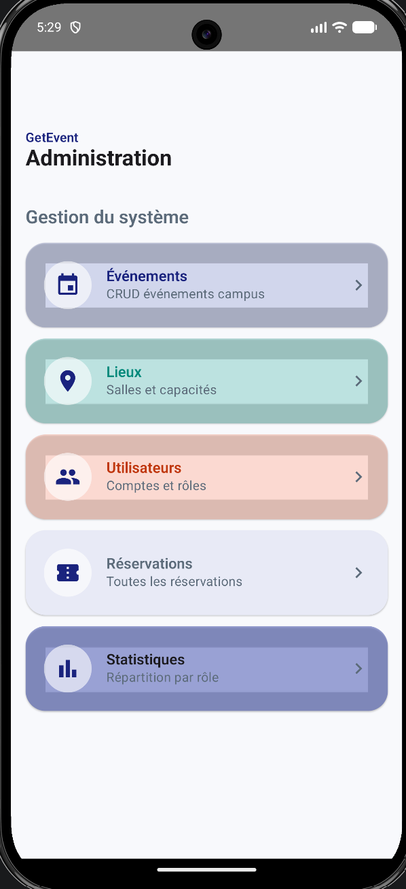
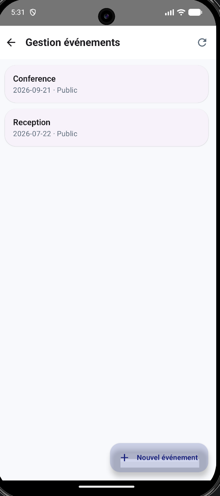
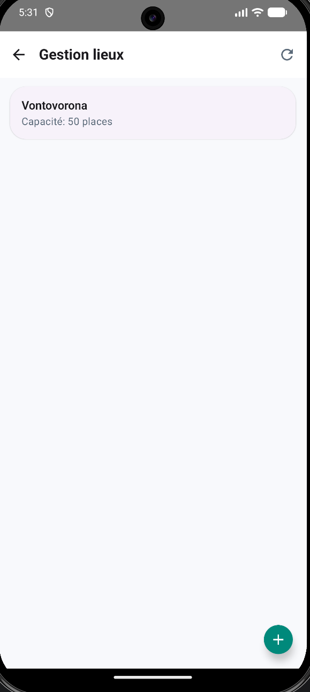
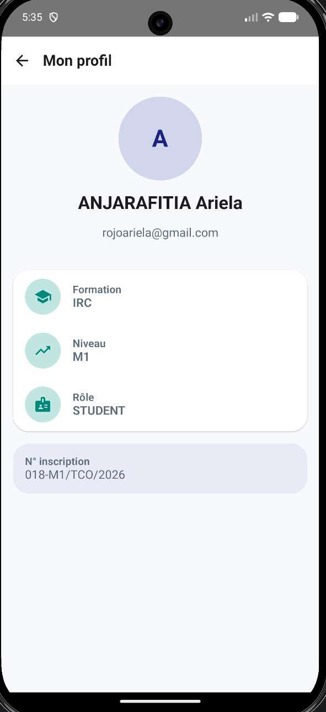
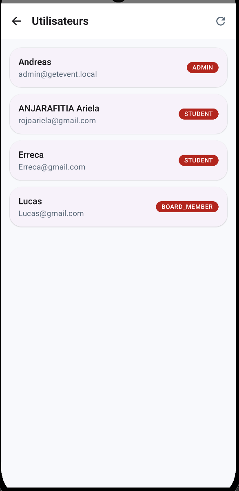
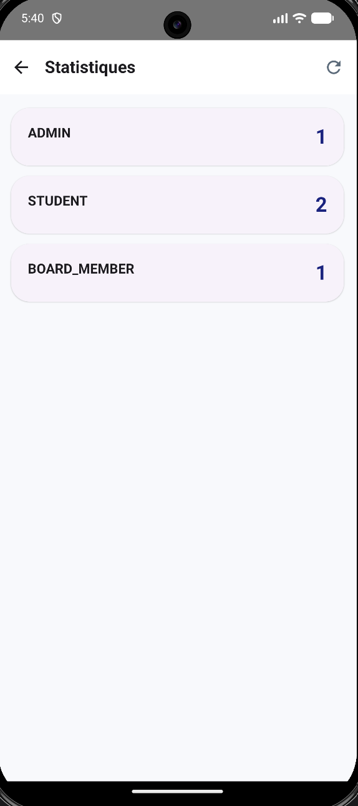

# Get Event

## Description

**Get Event** est une application de gestion d'événements permettant aux étudiants, administrateurs et membres du bureau (Board Members) de collaborer efficacement dans l'organisation et le suivi des événements.

L'application offre :

- Gestion des utilisateurs
- Gestion des événements
- Gestion des lieux (Locations)
- Tableau de bord avec statistiques
- Suivi des inscriptions aux événements

---

## Projet Académique

**Classe :** TCO M1 IRC

### Participants

- ANJARAFITIA Rojo Ny Ariela Joëlla
- FENOHOJA Erréca Mahenina
- BONNARD Hanson Lucas
- ANDRIAMBELOHASINA Cephastino Andréas

### Enseignant

Mr ANDRIANARISON Miradontsoa Asafa

---

## Release

Une version exécutable du projet est disponible dans cette même repository.

**Télécharger la Release :**

[Voir les Releases](../../releases)

---

## Captures d'écran

### Inscription (Registration)


### Connexion (Login)


### Dashboard



### Gestion des événements



### Gestion des lieux



### Profil utilisateur



### Liste des utilisateurs



### Statistiques



---

## Fonctionnalités par rôle

### Student

- Inscription et connexion
- Consultation des événements
- Participation aux événements
- Gestion du profil utilisateur

### Board Member

- Gestion des événements
- Validation des activités
- Consultation des statistiques
- Gestion de certaines informations organisationnelles

### Administrator

- Gestion complète des utilisateurs
- Création et gestion des événements
- Création et gestion des lieux
- Consultation des statistiques
- Gestion des rôles et permissions

---

## Comptes de démonstration

### Administrator

```text
Email: admin@getevent.com
Password: Admin123*
```

### Administrator
```text
Email: board@getevent.com
Password: Board123*
```
### Administrator
```text
Email: board@getevent.com
Password: Board123*
```
